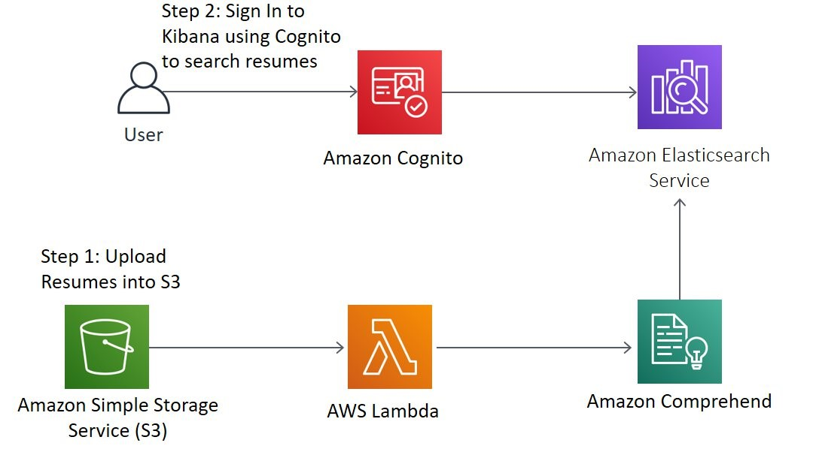

## Amazon Comprehend Document Search

Using Amazon Comprehend, Amazon Elasticsearch with Kibana, Amazon S3, Amazon Cognito to search over large number of documents such as pdf files.

## This sample includes:

* README.md - this file
* buildspec.yml - this file is used by AWS CodeBuild to package your
  application for deployment to AWS Lambda
* comprehend.py - this file contains the sample Python code for the web service
* template.yml - this file contains the AWS Serverless Application Model (AWS SAM) used
  by AWS CloudFormation to deploy your application to AWS Lambda, Comprehend and Elasticsearch
* requirements.txt - all project dependencies listed

## Architecture Diagram

Architecture below shows the core components. 

## Deploying CloudFormation Template

We will start by deploying an AWS CloudFormation template to provision the necessary AWS Identity and Access Management (IAM) role and Lambda function needed in order to interact with the Amazon S3, AWS Lambda, and Amazon Comprehend APIs.
	Region	Region Code	Launch
1	US East 
(N. Virginia)	us-east-1	 

1.	After clicking on the above link, the link will redirect you to the AWS Cloudformation console.In the CloudFormation console, leave the details and parameters above as default.
2.	Scroll down to Capabilities  as shown in the screen image below, and check both the boxes to provide acknowledgement to CloudFormation to create IAM resources. Click on “Create Change Set”.
Note: The CloudFormation template we’ve provided is written using AWS Serverless Application Model (AWS SAM). AWS SAM simplifies how to define functions, APIs, etc. for serverless applications, as well as some features for these services like environment variables. When deploying SAM templates in CloudFormation template, a transform step is required to convert the SAM template into standard CloudFormation, thus you must choose the Create Change Set button to make the transform happen.

  3. Wait a few seconds for the change set to finish computing changes. Your screen should look as follows.Finally, choose Execute and then let the CloudFormation launch resources in the background.

4.You will see the Status as “CREATE IN PROGRESS”, once the status is “CREATE COMPLETE” after sometime. Go to outputs, you will find the login URL to kibana and your S3 bucket name.

Copy the vaule for KibanaLoginURL in a separate notepad to access Kibana.
Also, Copy the value of the S3KeyPhraseBucket from the output and paste this in separate notepad to access S3.

## We will perform below steps:
Step 1: Upload document in the S3 bucket.
Step 2: Sign into Kibana using Cognito and search resume in Kibana.

## Step 1: Upload Resume in S3 bucket

Note:  You should replace this data with your own authorized data source of resumes when implementing your application. Also, make sure you are uploading resumes in .pdf format.

In the S3 Console, search for the bucket name you copied from the CloudFormation output. Choose your S3 bucket from the console and then choose Add resumes choose Upload.

## Step 2: Sign into Kibana using Cognito and Search documents in Kibana:

Paste the KibanaLoginURL Copied from Cloudformation Output.This URL will lead to SignUp page for Kibana:

•	Click on Sign Up,Enter Username, Name, Password and  valid Email. 
•	Click Signup.

Verify your kibana account with verification code sent to your email.

Sign In with your username and password, you will be redirected to Kibana Dashboard.

Click on “Discover”, go to “ Create Index Pattern” and type “resume” in the text box as shown below:

Do next and click on create index pattern

## Search your document

1.	Click on Discover, the description of attributes to be searched is below:
•	S3 link:  S3 Location of the document.
•	Keyphrases: Phrases from the resumes such as skills, technology etc.
•	Entity : can be searched on Date, Location, Organization and Person.
•	Text: all text of the resumes can be searched.

## Adding fields for search to Kibana Dashboard:

From Available Fields on left hand side of screen shown below,click add “Entity.OTHER, Entity.DATE, Entity.TITLE, Entity.QUANTITY, KeyPhrases, s3link and text” from the options.

Your Kibana Dashborad will look like this after adding the Available Fields

*Search tips: You can also use search combinations such as
Job or Entity Organization (For example Volunteer OR ABC Company)
Skill and Organization or Location (For example Python AND ABC Company OR Florida)

## Downloading search results

Copy the S3 link of the person in the result,You will be redirected to the S3 bucket where you uploaded the resume.Download the document by clicking Download:

## Advanced:

You can use this application with Amazon Textract (in preview) ,Amazon Textract is a service that automatically extracts text and data from scanned documents. Amazon Textract goes beyond simple optical character recognition (OCR) to also identify the contents of fields in forms and information stored in tables.
Using Textract with Comprehend and Elasticsearch, you will be able to search and analyze forms and scanned resumes.

## License Summary

This sample code is made available under a modified MIT license. See the LICENSE file.
